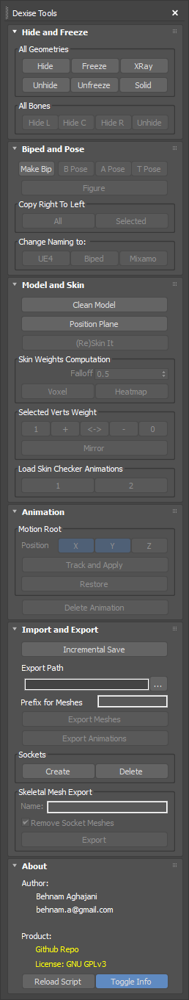

# 3dsMax-Asset-Tools-for-Unreal-Engine

### Hide and Freeze:
- Quick: Hide/Unhide, Freeze/UnFreeze, See Through/Solid,
- Quick: Hide Left Bones, Center Bones, Right Bones, Unhide All

### Biped and Pose:
- Make Mixamo Compatible Biped
- Change Biped Pose to Base, A-Pose, T-Pose
- Copy Right Bones To Left Bones
- Change Bones Naming to UE4, Biped, Mixamo

### Model and Skin:
- Clean Model ( Remove Bones and Skins > Convert To Editable Poly > Weld Vertices> > Quadrify )
- Show Hip Position Plane for Accurate Rigging
- Re-Apply Skin Modifier and Add All Existing Bones
- Quick: Skin Computation using Voxel and Heatmap
- Quick: Change Vertices' Weights
- Load Two Different Skin Checker Animation

### Animation:
- Create Root Motion Node for Animations
- Restore Original Animation
- Quick: Delete All Animation Keys

### Import and Export:
- Incremental Save
- Change Export Path
- Export Using Prefix
- Export Multiple Mesh into Multiple Files At Once
- Export All Animations in The Directory into Multiple Files
- Automatically Create Sockets for Mesh Attached into Bones
- Delete Created Sockets
- Export Skeletal Mesh Excluding Attached Meshes

### About:
- Reload The Script ( For Developing Purposes )
- Show/Hide Overlayed Text Info on Viewport
